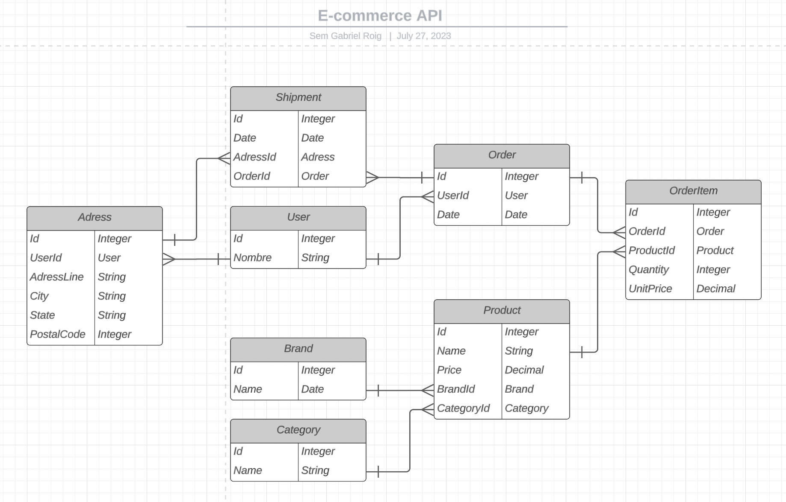

# Ecommerce-api

A generic API for an ecommerce backend service. Developed with Python FastAPI and PostgreSQL.

## Database entities architecture



## How to run locally

This project works with a Python virtual environment. For that sake, the first time you'll need to create that environment locally, activate it and install all the dependencies:

```
python -m venv env
source env/bin/activate
pip install -r requirements.txt
```

The next times, you'll just need to activate it 😉 and run the app:

```
source env/bin/activate
python3 -m uvicorn app.main:app --reload
```

When you are done working on the project, you can deactivate the virtual environment with just running:

```
deactivate
```

## Pendiente de armar

Cosas para agregar en el readme:
    file tree organization
    types declared using pydantic
    request and response schemas on documentation
        redoc
        docs

Cosas para agregar al proyecto:
    EmailStr con email_validator
    Deploy app en vercel con postgres
    Testing
    Docker container